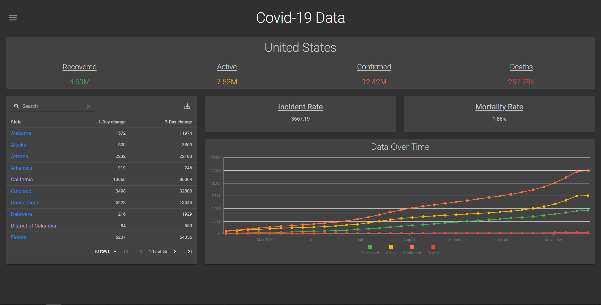
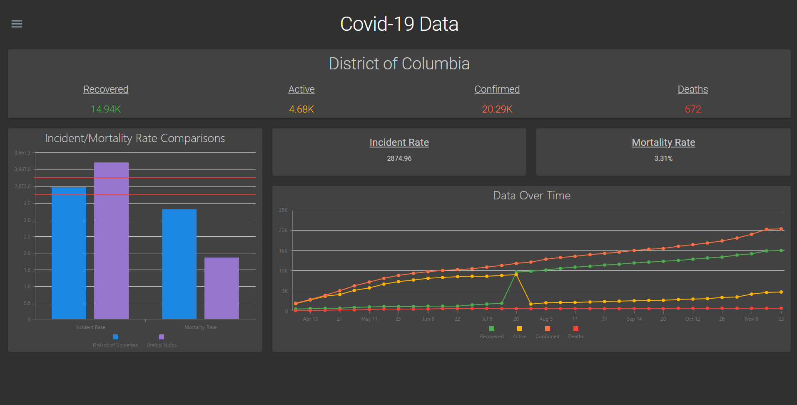

# Covid-19-Tracker-V2

<!-- PROJECT SHIELDS -->
<!--
*** I'm using markdown "reference style" links for readability.
*** Reference links are enclosed in brackets [ ] instead of parentheses ( ).
*** See the bottom of this document for the declaration of the reference variables
*** for contributors-url, forks-url, etc. This is an optional, concise syntax you may use.
*** https://www.markdownguide.org/basic-syntax/#reference-style-links
-->
<!-- [![Contributors][contributors-shield]][contributors-url] -->
[![Stargazers][stars-shield]][stars-url]
[![MIT License][license-shield]][license-url]
[![LinkedIn][linkedin-shield]][linkedin-url]

<!-- PROJECT LOGO -->
 

  

  <h3 align="center">Covid Tracker V2</h3>

  

    Visualization dashboard to see key data related to Covid-19.
     
    <a href="https://covid-tracker-v2.herokuapp.com/">View On Heroku</a>
    ·
    <a href="https://github.com/bhaden94/Covid-19-Tracker-V2/issues">Report an Issue With This Documentation</a>
  

<!-- TABLE OF CONTENTS -->
## Table of Contents

* [About the Project](#about-the-project)
  * [Parts of Code](#parts-of-code)
* [Contributing](#contributing)
* [License](#license)
* [Contact](#contact)
* [Acknowledgements](#acknowledgements)

<!-- ABOUT THE PROJECT -->
## About The Project

### Parts of Code
* [React Frontend](https://github.com/bhaden94/covid-19-tracker-v2-fe)
* [Spring Boot/MongoDB Backend](https://github.com/bhaden94/Covid19-tracker-V2-API)

<!-- USAGE EXAMPLES -->
## Usage

This app was built to give you a visual dashboard for the key data as it relates to the Covid-19 virus.

<!-- LICENSE -->
## License

Distributed under the MIT License. See `LICENSE` for more information.

<!-- CONTACT -->
## Contact

Brady Haden - [LinkedIn](https://www.linkedin.com/in/brady-s-haden/)

<!-- ACKNOWLEDGEMENTS -->
## Acknowledgements
* [Johns Hopkins University Center for Systems Science and Engineering (JHU CSSE)](https://github.com/CSSEGISandData/COVID-19)
* [Img Shields](https://shields.io)

<!-- MARKDOWN LINKS & IMAGES -->
<!-- https://www.markdownguide.org/basic-syntax/#reference-style-links -->
<!-- [contributors-shield]: https://img.shields.io/github/contributors/othneildrew/Best-README-Template.svg?style=flat-square
[contributors-url]: https://github.com/othneildrew/Best-README-Template/graphs/contributors -->
[stars-shield]: https://img.shields.io/github/stars/bhaden94/Covid-19-Tracker-V2.svg
[stars-url]: https://github.com/bhaden94/Covid-19-Tracker-V2/stargazers

[license-shield]: https://img.shields.io/github/license/bhaden94/Covid-19-Tracker-V2.svg
[license-url]: https://github.com/bhaden94/Covid-19-Tracker-V2/blob/master/LICENSE.txt

[linkedin-shield]: https://img.shields.io/badge/-LinkedIn-black.svg?logo=linkedin&colorB=555
[linkedin-url]: https://www.linkedin.com/in/brady-s-haden/
[product-screenshot]: images/screenshot.png
